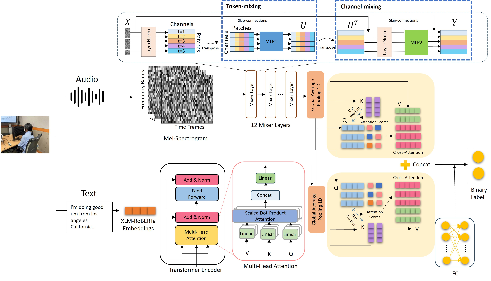

##  Cross-Modality based Depression Detection Model 

This repository contains a lightweight multimodal model for detecting depression using **audio** and **text** data. It integrates **cross-modality fusion** techniques to analyze non-linguistic and linguistic features, enabling efficient and accurate depression detection across multiple languages (English, Chinese, Korean).

Paper: https://doi.org/10.1016/j.compbiomed.2024.109618


##  Overview




Summarize our model:

- **Audio processing** using Mel spectrograms and MLP-Mixer for lightweight training. 
- **Text feature extraction** with pre-trained XLM-RoBERTa. 
- **Cross-modality fusion** to dynamically interact between audio and text features for better prediction performance.

Used Three datasets:

1. **DAIC-WOZ** (English) : [https://dcapswoz.ict.usc.edu/]()
2. **EATD-Corpus** (Chinese) https://github.com/Fancy-Block/EATD-Corpus?tab=readme-ov-file
3. **Korean Depression Dataset** (Korean) https://aihub.or.kr/aihubdata/data/view.do?dataSetSn=573


## Installation

Install dependencies using the provided `requirements.txt` file: 

```python
pip install -r requirements.txt
```


## Citation

Eunchae Lim, Min Jhon, Ju-Wan Kim, Soo-Hyung Kim, Seungwon Kim, and Hyung-Jeong Yang, "A Lightweight Approach Based on Cross-Modality for Depression Detection", Computers in Biology and Medicine, Vol. 186, 109618, 2025


## Acknowledgments

This work was supported in part by the National Re search Foundation of Korea (NRF) grant funded by the Korea Government [Ministry of Science and ICT (MSIT)] under Grant RS-2023-00219107, in part by the Institute of Information and Communications Technology Planning and Evaluation (IITP) through the Artificial Intelligence Convergence Innovation Human Resources Development grant funded by the Korea Government (MSIT) under Grant IITP-2023-RS-2023-00256629, in part by Chonnam Na tional University Hwasun Hospital Institute for Biomedical Science under Grant HCRI 23026, and in part by the MSIT, Korea, under the ITRC (Information Technology Research Center) support program (IITP-2024-RS-2024-00437718) supervised by the IITP.

